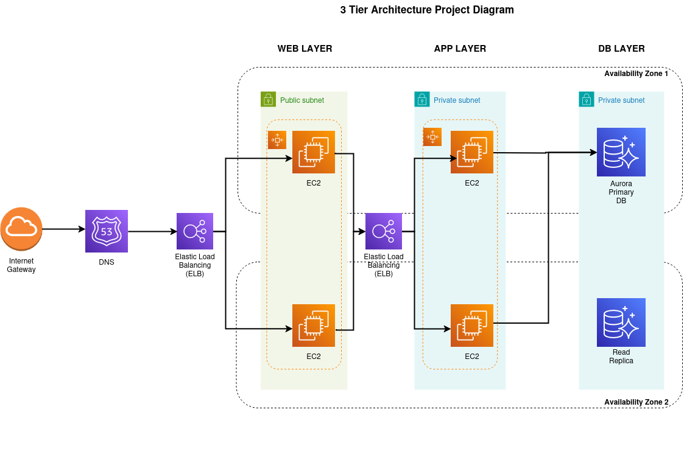

# Three-Tier AWS Infrastructure Project

## Overview

This project implements a scalable three-tier architecture on AWS using Infrastructure as Code (IaC) with Terraform. The architecture consists of:

- Frontend tier: React application
- Application tier: Python Flask backend
- Database tier: AWS RDS MySQL

The infrastructure is designed with high availability in mind, utilizing multiple Availability Zones, load balancers, and private subnets for enhanced security.



## Architecture Components

- **VPC Configuration**
  - Custom VPC with 6 subnets across 2 Availability Zones
  - 4 private subnets (App and DB tiers)
  - 2 public subnets (ALB tier)
  - NAT Gateway for private subnet internet access
  - Enabled DNS hostnames and resolution

- **Security Groups**
  - Web-ALB-SG: External ALB security group
  - Web-SG: Frontend tier security group
  - App-SG: Backend tier security group
  - Internal-ALB-SG: Internal ALB security group
  - RDS-SG: Database tier security group

- **Load Balancers**
  - External ALB for frontend tier
  - Internal ALB for backend tier

- **Compute Resources**
  - Frontend EC2 instances (Ubuntu 24.04 LTS)
  - Backend EC2 instances (Ubuntu 24.04 LTS)
  - IAM roles with necessary permissions

- **Database**
  - MySQL 8.0.35 on RDS
  - Multi-AZ DB subnet group

## Prerequisites

- AWS Account with appropriate permissions
- Terraform installed (version 1.0.0 or later)
- AWS CLI configured with necessary credentials
- Git installed

## Quick Start

1. Clone the repository:
```bash
git clone [repository-url]
cd IaC
```

2. Initialize Terraform:
```bash
terraform init
```

3. Review the infrastructure plan:
```bash
terraform plan
```

4. Deploy the infrastructure:
```bash
terraform apply
```

5. After successful deployment, you'll receive:
   - External ALB DNS name for accessing the application
   - Internal ALB DNS name for backend services
   - RDS endpoint for database connectivity

## Security Features

- Private subnets for application and database tiers
- Security groups with principle of least privilege
- Session Manager access for secure instance management
- IAM roles with specific permissions
- Network isolation between tiers

## Infrastructure Management

### Connecting to Instances
- Instances are deployed in private subnets
- Access is available through AWS Systems Manager Session Manager
- No SSH key management required

### Monitoring and Maintenance
- Health checks configured for both load balancers
- RDS monitoring capabilities
- CloudWatch metrics available for EC2 instances

## Next Steps

1. **Domain Integration**
   - Set up Route 53 hosted zone
   - Register custom domain
   - Configure DNS records
   - Implement SSL/TLS certificates

2. Future Enhancements
   - Implement CI/CD pipeline
   - Add monitoring and alerting
   - Configure backup and disaster recovery
   - Implement auto-scaling

## Project Structure

```
.
├── IaC/
│   ├── main.tf
│   ├── variables.tf
│   ├── outputs.tf
│   ├── modules/
│   │   ├── alb/
│   │   ├── ec2/
│   │   │    │└── scripts/
│   │   │    │   ├── launch_app-tier.sh
│   │   │    │   └── launch_web-tier.sh
│   │   ├── iam/
│   │   ├── rds/
│   │   └── security_groups/
│   │   └── vpc/
├── app-tier-python/
├── web-tier/
└── README.md
```

## Contributing

1. Fork the repository
2. Create a feature branch
3. Commit your changes
4. Push to the branch
5. Create a Pull Request

## Contact

[Uzair Gabol] - [gaboluzair0@gmail.com]

Project Link: [https://github.com/uzairgabol/aws-3tier-application]